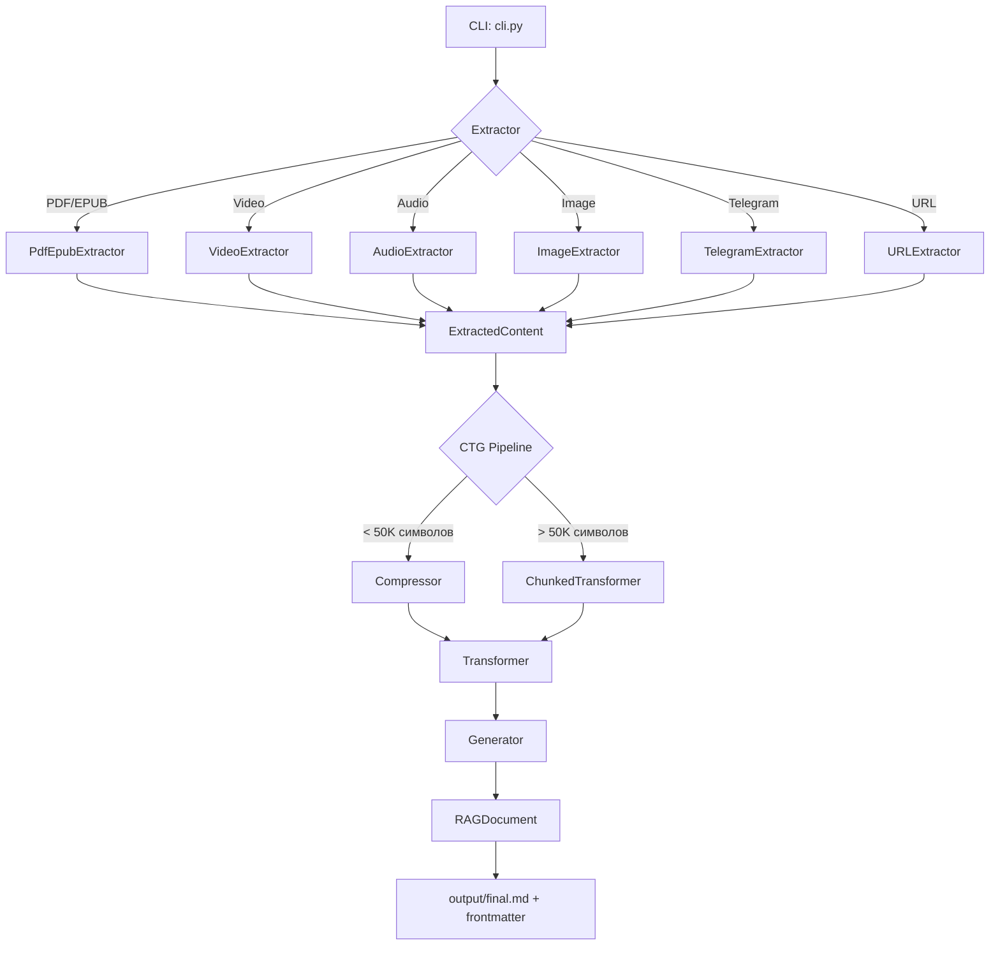

# Project Context — media2rag

## Архитектура (1 абзац)

media2rag — CLI-инструмент на Python, который конвертирует разнородные медиа (PDF, EPUB, видео, аудио, изображения, веб-страницы, Telegram-посты) в RAG-ready Markdown с метаданными. Использует двухфазный подход: (1) извлечение контента через специализированные экстракторы, (2) CTG-пайплайн (Compress → Transform → Generate) для структурирования через LLM. Поддерживает локальный (Ollama) и облачный (OpenRouter) бэкенды, с автоматическим фоллбэком.

## Ключевые компоненты

| Компонент | Файл | Назначение |
|-----------|------|------------|
| **CLI Entry Point** | `cli.py` | Маршрутизация по типу файла, управление воркспейсом, JSON-режим для GUI |
| **Config** | `config.py` | Загрузка настроек из `.env` через dataclass (без Pydantic) |
| **Domain Models** | `domain/document.py` | `ExtractedContent`, `RAGDocument`, `DocumentMetadata`, `Claim` |
| **Extractors** | `extractors/*.py` | PDF/EPUB (PyMuPDF), Video/Audio (yt-dlp + Whisper), Image (Ollama Vision), Telegram, URL, Markdown |
| **CTG Pipeline** | `processors/ctg_pipeline.py` | Compressor → Transformer → Generator; для больших документов — ChunkedTransformer (map-reduce) |
| **LLM Clients** | `clients/*.py` | `OllamaClient`, `OpenRouterClient` с единым интерфейсом |
| **Workspace** | `.media2rag.yaml` + подпапки | Прогресс, промежуточные файлы, чанки, секции, выход |

## Потки данных



## Мои предпочтения (что люблю/не люблю в коде)

| ✅ Люблю | ❌ Не люблю |
|----------|-------------|
| dataclass вместо Pydantic (когда не нужна валидация) | Избыточные комментарии |
| Явные фоллбэки (Ollama → OpenRouter) | Магические числа без констант |
| JSON-режим для интеграций | Тесты ради тестов (лучше ручная проверка) |
| Воркспейс с прогрессом (`.media2rag.yaml`) | Жёсткая типизация ради типизации |
| Локальные LLM по умолчанию | CI/CD без необходимости |
| OCR-фоллбэк для PDF | |

## Где что искать (Quick Reference)

### Обработка файла
1. `cli.py:process_single()` — точка входа
2. `extractors/` — выбор экстрактора по расширению/URL
3. `processors/ctg_pipeline.py:process()` — CTG-пайплайн
4. `domain/document.py:RAGDocument.save()` — сохранение

### Добавление экстрактора
- Создать класс в `extractors/` с наследованием от `BaseExtractor`
- Реализовать `supports(source)` и `extract(source, workspace_dir)`
- Добавить в `cli.py:get_extractors()`

### Изменение LLM-логики
- `clients/ollama_client.py` — локальные вызовы (`/api/generate`, `chat_with_image`)
- `clients/openrouter_client.py` — облачные вызовы (`/chat/completions`, OpenAI-совместимый)
  - Встроен ретрай с exponential backoff (до 3 попыток)
  - Обрабатывает 429 (rate limit), URLError (таймаут), JSONDecodeError
  - `max_tokens` по умолчанию 16000
- `processors/*.py` — промпты и парсинг

### Конфигурация
- `.env` — API-ключи, URL, модели
- `config.py` — структура конфига
- CLI-аргументы переопределяют `.env`

### Воркспейс
```
workspace/
  <source_name>/
    .media2rag.yaml    # прогресс, метаданные
    chunks/            # исходные чанки
    sections/          # обработанные секции
    intermediate/      # raw.md
    images/            # извлечённые изображения
    output/            # final.md
```

## Расширения (Swift)

В проекте также есть 17 Swift-файлов — это отдельный iOS/macOS компонент (XcodeBuildMCP интеграция). Не связан напрямую с media2rag pipeline.

---

*Последнее обновление: 2026-05-21*
*Для актуализации: после значимых изменений в архитектуре обновляй этот файл*

## Changelog

- **2026-05-21**: OpenRouterClient — ретрай с exponential backoff (3 попытки), обработка 429/URLError/JSONDecodeError
- **2026-05-21**: `cli.py:_resume_processing` — исправлен `UnboundLocalError` с `newline_idx`
- **2026-05-21**: `chunked_transformer._load_all_metadata` — итерация по ключам а не range(len(data))
- **2026-05-21**: `transformer.py` — `topics` копирует `domains` (GUI показывал "тем: 0")
- **2026-05-21**: `cli.py:_resume_processing` — сохраняет `source_type` из YAML вместо hardcoded "markdown"
- **2026-05-21**: `ctg_pipeline.py` — не создаёт лишний ChunkedTransformer (использует существующий)
- **2026-05-21**: Дефолтная модель Ollama заменена `gemma4:26b` → `qwen3.5:27b` (лучше следует инструкциям для JSON, ~18GB Q4_K_M)
